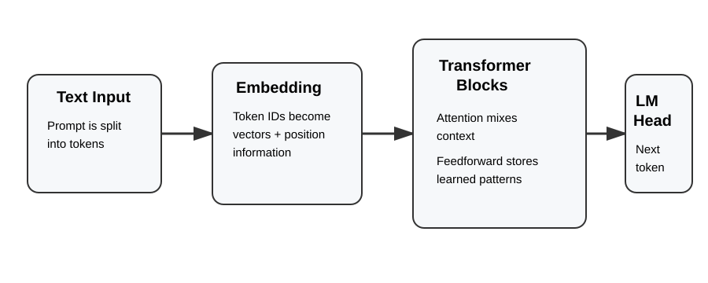
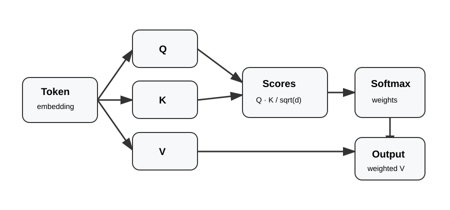

# Understanding Transformer LLMs

A hands-on repository for understanding how transformer-based large language models process text, represent meaning, and generate language.

This repo focuses on building **intuition + practical understanding** through:

* clear explanations
* visual diagrams
* interactive experiments
* small working implementations

---

## What You’ll Learn

* How text is converted into numerical representations
* Why transformers replaced earlier approaches
* How tokenization differs across models
* The structure of transformer architectures
* How attention captures context
* How models generate text step-by-step
* How real implementations map to theory

---

## Transformer Pipeline at a Glance



A decoder-only LLM follows this pipeline:

1. **Text input**
2. **Tokenization**
3. **Token IDs**
4. **Embeddings**
5. **Transformer blocks (attention + feedforward)**
6. **Language model head**
7. **Next token prediction (loop)**

---

## 1. From Counting Words to Contextual Meaning

### Bag-of-Words

Counts words but ignores order and meaning.

```
The cat sat near the bank.
The bank approved the loan.
```

---

### Word Embeddings (Word2Vec)

* Words → vectors
* Similar context → similar vectors
* Still one meaning per word

---

### Transformer Embeddings

Transformers create **contextual embeddings**:

```
The fisherman sat near the bank.
The customer walked into the bank.
```

Same word → different meaning → different representation.

---

## 2. Tokenization

LLMs process **tokens**, not raw text.

```
text → tokens → token IDs
```

A token can be:

* word
* subword
* punctuation
* byte-level unit

### Notebook

```
notebooks/01_tokenizer_comparison.ipynb
```

---

## 3. Embeddings

```
token ID → embedding vector
```

These vectors encode semantic meaning.

### Positional Information

Order matters:

```
The dog chased the cat.
The cat chased the dog.
```

Handled using:

* positional embeddings
* rotary embeddings (modern models)

---

## 4. Transformer Block

Core unit:

* Self-attention
* Feedforward (MLP)
* Residual connections
* Layer normalization

---

## 5. Self-Attention



Each token creates:

* Query (Q)
* Key (K)
* Value (V)

```
attention = weighted sum of value vectors
```

### Key idea:

Tokens decide what matters dynamically.

---

### Causal Attention

* Can look at past tokens
* Cannot see future tokens

This enables generation.

---

## 6. Feedforward Layers

* Processes each token independently
* Adds learned transformations

**Intuition:**

* Attention = communication
* Feedforward = reasoning

---

## 7. Language Model Head

```
hidden state → logits → probabilities → next token
```

Common decoding:

* greedy
* sampling
* top-k
* nucleus (top-p)

---

## 8. KV Cache

Stores past key/value pairs → avoids recomputation → speeds up generation.

---

## 9. Model Exploration

```
notebooks/02_decoder_model_and_generation.ipynb
```

Explore a real model using Hugging Face.

---

## Repository Structure

```
.
├── assets/
│   ├── transformer_overview.svg
│   └── attention_qkv.svg
│
├── notebooks/
│   ├── 01_tokenizer_comparison.ipynb
│   └── 02_decoder_model_and_generation.ipynb
│
├── llm_playground/
│   ├── attention_visualizer.py
│   ├── attention_heatmap.py
│   ├── tokenizer_comparison.py
│   ├── mini_transformer.py
│   └── streamlit_app.py
│
├── README.md
├── requirements.txt
└── .gitignore
```

---

## LLM Playground

Small experiments to build intuition.

### Attention Visualizer

```bash
python llm_playground/attention_visualizer.py
```

---

### Attention Heatmap

```bash
python llm_playground/attention_heatmap.py
```

Visualizes how tokens attend to each other.

---

### Tokenizer Comparison

```bash
python llm_playground/tokenizer_comparison.py
```

Compare how different models tokenize the same text.

---

### Mini Transformer

```bash
python llm_playground/mini_transformer.py
```

A minimal transformer implementation with:

* self-attention
* transformer block
* causal masking
* text generation loop

---

### Streamlit App

```bash
streamlit run llm_playground/streamlit_app.py
```

Interactive UI for:

* tokenization
* attention visualization

---

## Setup

```bash
pip install -r requirements.txt
```

Run notebooks:

```bash
jupyter notebook
```

---

## Suggested Learning Path

1. Read this README
2. Run tokenizer notebook
3. Run tokenizer script
4. Explore attention visualizations
5. Run mini transformer
6. Use Streamlit app
7. Modify and experiment

---

## Ideas for Extensions

* attention heatmap from real models
* decoding strategy comparison
* mini transformer training loop
* Streamlit enhancements
* tokenizer visualization UI

---

## Key Takeaway

Transformers work by:

* converting text → tokens → vectors
* using attention to share information
* refining representations through layers
* predicting the next token

Once this loop clicks, modern LLMs become much easier to understand.

New insights are welcomed.
